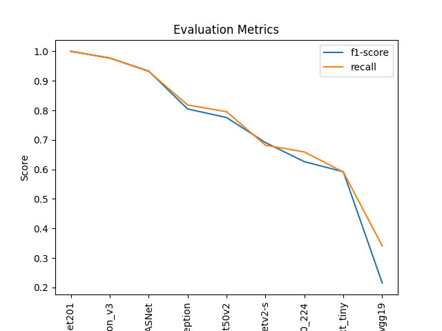
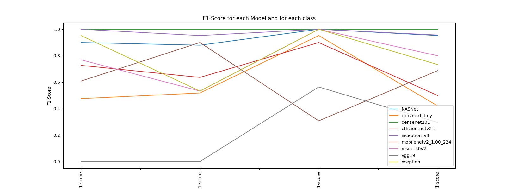
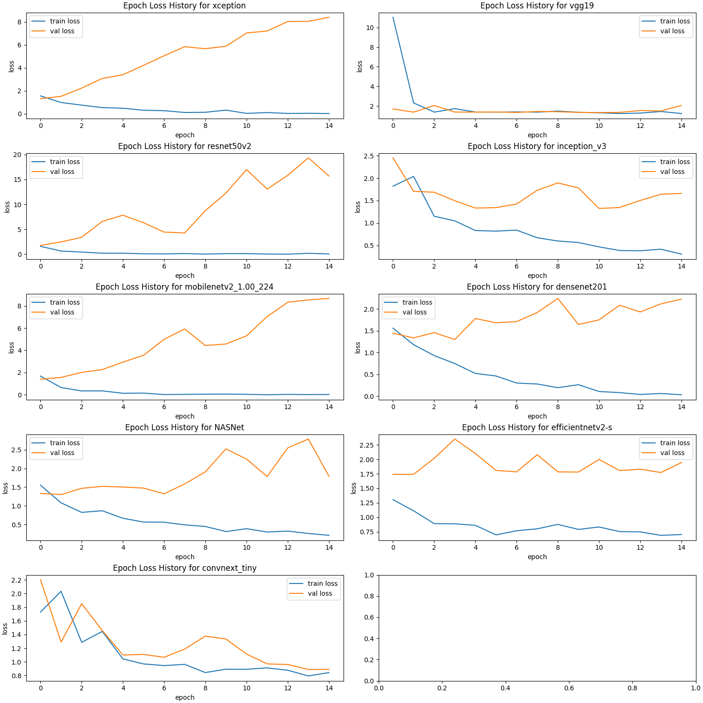
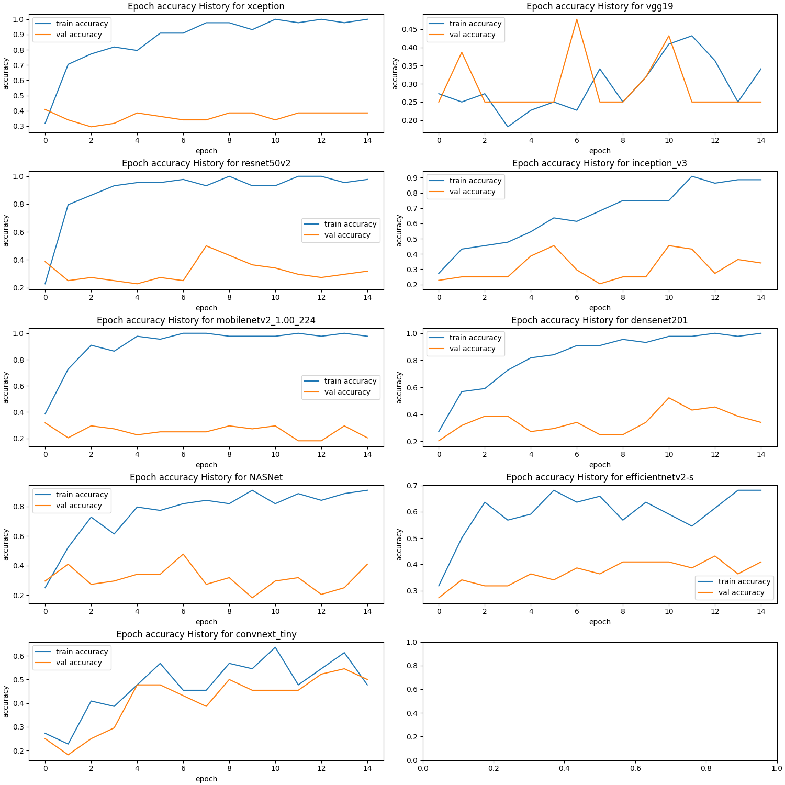

# Assignment 1 - Transfer Learning - Accuracy comparison of various pre-trained CNN Model for Chest CT Scan Image classification

## Reference Links
- [Dataset and Base ipynb file](https://wilpbitspilaniacin0.sharepoint.com/:u:/r/sites/DeepLearningS2-23_SSZG529Regular/Shared%20Documents/General/TL_Full_Docs.zip?csf=1&web=1&e=iq7uXq)

- Assignment Description 1 [Lecture Recording at 44:59](https://wilpbitspilaniacin0.sharepoint.com/:v:/r/sites/DeepLearningS2-23_SSZG529Regular/Shared%20Documents/General/Recordings/Deep%20Learning%20(S2-23_SSZG529)(Regular)-20240307_191148-Meeting%20Recording.mp4?csf=1&web=1&e=e2Cvx6&nav=eyJyZWZlcnJhbEluZm8iOnsicmVmZXJyYWxBcHAiOiJTdHJlYW1XZWJBcHAiLCJyZWZlcnJhbFZpZXciOiJTaGFyZURpYWxvZy1MaW5rIiwicmVmZXJyYWxBcHBQbGF0Zm9ybSI6IldlYiIsInJlZmVycmFsTW9kZSI6InZpZXcifSwicGxheWJhY2tPcHRpb25zIjp7InN0YXJ0VGltZUluU2Vjb25kcyI6MjcyOX19)

- Assignment Description 2 [Lecture Recording at 42:20](https://wilpbitspilaniacin0.sharepoint.com/:v:/r/sites/DeepLearningS2-23_SSZG529Regular/Shared%20Documents/General/Recordings/Deep%20Learning%20(S2-23_SSZG529)(Regular)-20240324_180801-Meeting%20Recording.mp4?csf=1&web=1&e=wYVGSX&nav=eyJyZWZlcnJhbEluZm8iOnsicmVmZXJyYWxBcHAiOiJTdHJlYW1XZWJBcHAiLCJyZWZlcnJhbFZpZXciOiJTaGFyZURpYWxvZy1MaW5rIiwicmVmZXJyYWxBcHBQbGF0Zm9ybSI6IldlYiIsInJlZmVycmFsTW9kZSI6InZpZXcifSwicGxheWJhY2tPcHRpb25zIjp7InN0YXJ0VGltZUluU2Vjb25kcyI6MjU0MH19)

- [Reference Research Paper](https://www.researchgate.net/figure/The-accuracy-comparison-of-pre-trained-CNN-models_tbl2_335717881)

## Dataset
Chest CT Scan 

## Assignment Description
 1. The Transfer_Learning.ipynb file used InceptionV3 pre-trained model to classify Chest CT Scan images into 4 categories. The assignment is to predict with other pre-trained model like InceptionV3 and compare each other for accuracy and other evaluation metrics. 
 2. As discussed in the class, try to vary the various hyper parameters and report the images generated.

## Different Class labels
- adenocarcinoma
- large.cell.carcinoma
- normal
- squamous.cell.carcinoma

## Different Pre-trained models evaluated 
- Xception 
- VGG19
- ResNet50V2
- InceptionV3
- MobileNetV2
- DenseNet201
- NASNetMobile
-  EfficientNetV2S
- ConvNeXtTiny

## Model Comparison

| Model Name           |   No of Layers |   No of Conv layers | Total params   | Trainable params   | Non-trainable params   |   accuracy |   f1-score |   recall |   support |
|:---------------------|---------------:|--------------------:|:---------------|:-------------------|:-----------------------|-----------:|-----------:|---------:|----------:|
| densenet201          |            714 |                 692 | 195.70244M     | 15.3466M           | 180.35584M             |   1        |   1        | 1        |        44 |
| inception_v3         |            318 |                  94 | 231.1658M      | 13.13988M          | 218.02592M             |   0.977273 |   0.977226 | 0.977273 |        44 |
| NASNet               |            776 |                 372 | 50.75608M      | 8.06244M           | 42.69364M              |   0.931818 |   0.933095 | 0.931818 |        44 |
| xception             |            139 |                 111 | 221.75276M     | 68.10116M          | 153.6516M              |   0.818182 |   0.804762 | 0.818182 |        44 |
| resnet50v2           |            197 |                 182 | 248.78596M     | 47.2986M           | 201.48736M             |   0.795455 |   0.775641 | 0.795455 |        44 |
| efficientnetv2-s     |            520 |                 110 | 212.5194M      | 18.42756M          | 194.09184M             |   0.681818 |   0.690909 | 0.681818 |        44 |
| mobilenetv2_1.00_224 |            161 |                   5 | 31.78564M      | 16.5306M           | 15.25504M              |   0.659091 |   0.625972 | 0.659091 |        44 |
| convnext_tiny        |            140 |                 131 | 284.78564M     | 54.23876M          | 230.54688M             |   0.590909 |   0.592036 | 0.590909 |        44 |
| vgg19                |             29 |                  16 | 205.51748M     | 182.2618M          | 23.25568M              |   0.340909 |   0.2151   | 0.340909 |        44 |

## Plots

***

***

***
